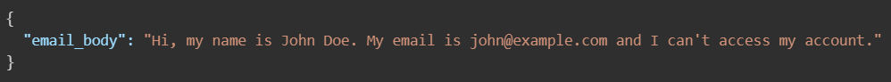
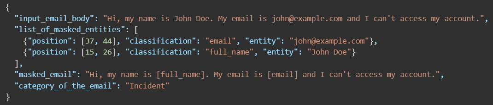

# Email Classifier with PII masking

This project demonstrates how to build an email classifier system to :

- **Mask personally identifiable information (PII)** like name, email, phone number, card number from emails.
- **Classify** emails into categories like 'Request', 'Incident', 'Change', 'Problem'.

---

## Tech Stack

- **Language**: Python 3
- **Framework**: FastAPI
- **ML**: Scikit-learn (Multinomial Naive Bayes)
- **Text Preprocessing**: Regex, SpaCy (for NER)
- **Model Saving**: Joblib
- **Deployment Ready**: Yes, via Uvicorn server

---

## Features

- Regex + Spacy powered PII masking
- Trained Multinomial Naive Bayes classifier (TF-IDF)
- REST API built with FastAPI
- Strict JSON format output
- Ready for deployment and production usage

---

## Model Performance

- Accuracy: 71.5%
- Classifier: Multinomial Naive Bayes with TF-IDF vectorization
- Most Confident Class: Request (F1 = 0.88)


## Example Request & Response

### Request


### Response


## Project Structure

email-classifier\
    |
    |--data\
        |--combined_emails_with_natural_pii.csv
    |--saved_model\
        |--model.pkl
        |--tfidf.pkl
    |--api.py
    |--model.py
    |--utils.py
    |--README.md
    |--requirements.txt


## How to Run Locally

### 1. Clone the Repository

```
git clone < repo-link >
cd email_classifier_project
```

### 2. Create Virtual Environment (Optional but recommended)

```
python -m venv email_classifier
source email_classifier/bin/activate  # Mac/Linux
email_classifier\Scripts\activate     # Windows
```

### 3. Install Requirements
```

pip install -r requirements.txt
python -m spacy download en_core_web_sm
```

### 4. Start the FastAPI Server

```
uvicorn api:app --reload
```

## Test the API (Swagger UI)

```
- Open your browser and go to: http://127.0.0.1:8000/docs
- Use the /classify-email endpoint to test!
```

## Future Improvements

- Use n-gram features for better phrase detection
- Try SVM or Logistic Regression
- Experiment with contextual models like BERT
- Add logging and exception handling to the API
- Containerize the app using Docker
